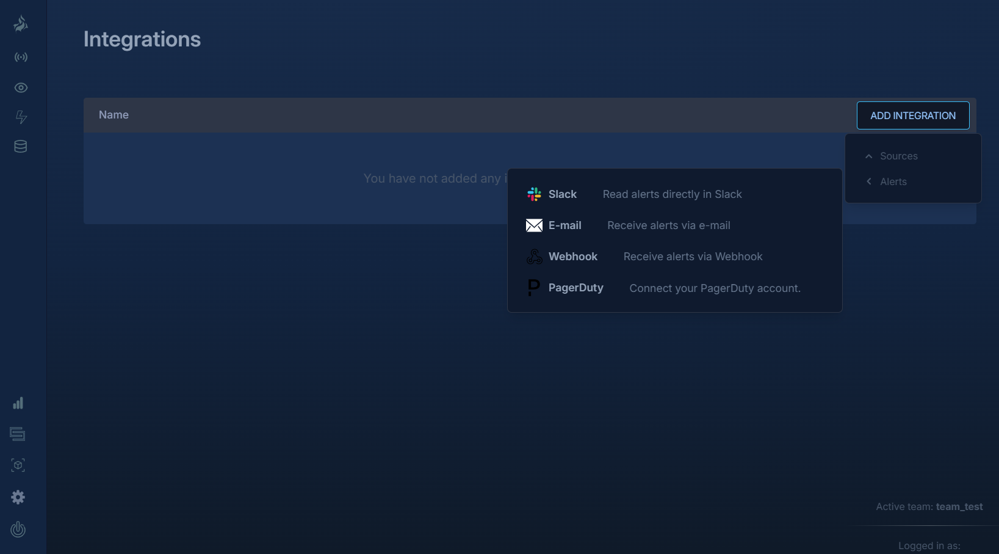

Learn how to integrate Logfire with PagerDuty to enhance your alert management system. Logfire's integration with PagerDuty allows alerts from Logfire to trigger events in PagerDuty, ensuring efficient monitoring and incident response.

## About PagerDuty Alert Integration

Logfire’s alert integration with PagerDuty interfaces with the PagerDuty Event API, enabling alerts generated on Logfire platform to trigger events in PagerDuty. This integration ensures that your monitoring and alerting system is robust, responsive, and always in sync.

## Integrating with PagerDuty

To set up the PagerDuty integration in Logfire, follow these steps:

1. **Start Integration Process**: On the integrations page within Logfire, select the PagerDuty under alerts dropdown menu on ADD INTEGRATION button.

2. **Authorize Integration**: You will be redirected to PagerDuty, where you need to authorize the integration by entering your email address and password for your PagerDuty account.
3. **Select PagerDuty Service**: After authorization, select the PagerDuty service that will log alerts from Logfire, and then click 'Connect'.
4. **Save Your Logfire Alert**: This completes the integration of your pagerduty services to be recipient of alert events on Logfire alert trigger. To start receiving your alerts, you will have to add one of the pagerduty service integrated to your logfire team to the alert and new alerts will be displayed in your PagerDuty incidents dashboard.

## Testing Your PagerDuty Integration

Before finalizing your integration setup, you can trigger a test alert:

- Choose to trigger a test alert with test data, even before saving your PagerDuty alert in Logfire.
- Ensure that a connected source from PagerDuty is selected to create a successful test alert.

## Deleting Your PagerDuty Integration

If you need to remove the PagerDuty integration:

1. **Access Integration Settings**: Log in to the Logfire Web App and navigate to Integrations.
2. **Find PagerDuty Integration**: Select your PagerDuty integration checkbox next to it.
3. **Remove the Service**: Click the 'dustbin' icon in the integration list header if you want to delete.

By integrating Logfire with PagerDuty, you can streamline your alert management process, ensuring quick and efficient incident handling and response.
